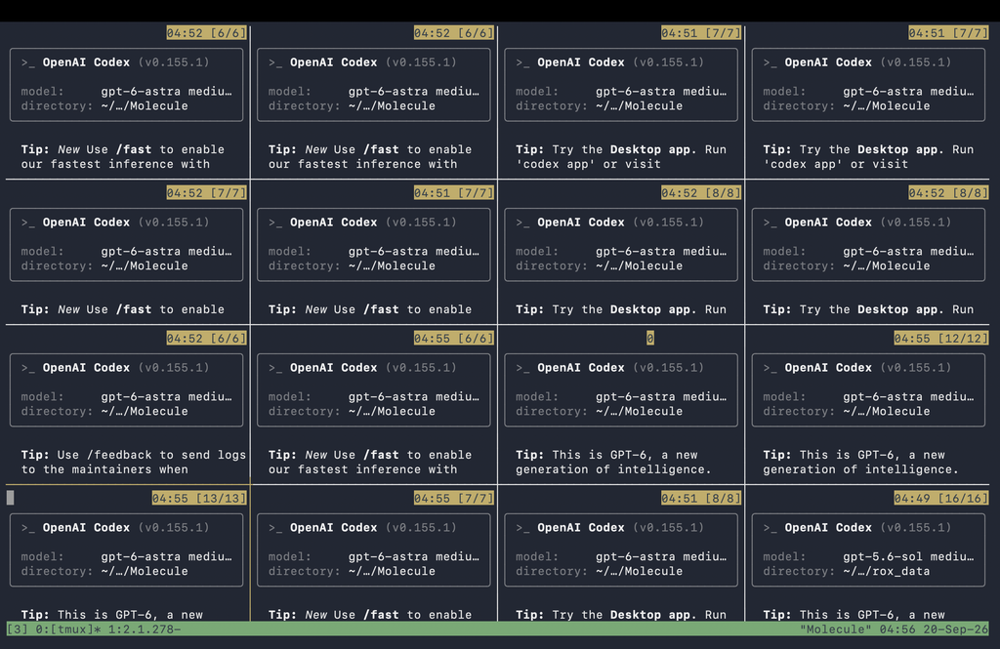

# Codex Evidence

## Parallel Codex sessions (2026-09-20)

tmux grid of Codex CLI sessions used during the Hack the North build:

## Zero-capacity feasibility regression

- Initial behavior or failing test: the first solver eligibility expression used Python truthiness for `capacity.available`. A canonical value of `0` therefore fell back to the requested quantity and could remain eligible.
- Evidence and diagnosis: boundary review showed `(available or requested_quantity)`, which conflated a known zero with an unknown `None`.
- Change made: capacity is now accepted only when it is explicitly unknown or greater than/equal to requested quantity. Graph validation was tightened at the same time so unknown edge endpoints are rejected before NetworkX can auto-create them.
- Regression/adversarial test: `test_zero_capacity_is_not_treated_as_unknown`, `test_cyclic_plan_graph_is_rejected`, currency mismatch rejection, quote timeout storm, stale CAS write, and duplicate action-key tests.
- Commands and sanitized output:
  - `pnpm test` → all TypeScript contract, OpenAI, orchestrator, and web suites passed.
  - `pnpm solver:test` → solver suite passed.
  - `pnpm solver:lint` → Ruff and strict MyPy passed.
- Commit or pull request: implementation is present in the current working tree; no commit was created by the agent.
- Remaining limitations: the credentialed OpenAI smoke and physical microphone barge-in check require a project API key and interactive browser hardware. CI uses provider mocks for those boundaries.

Do not include secrets, private model reasoning, or raw sensitive provider payloads.
