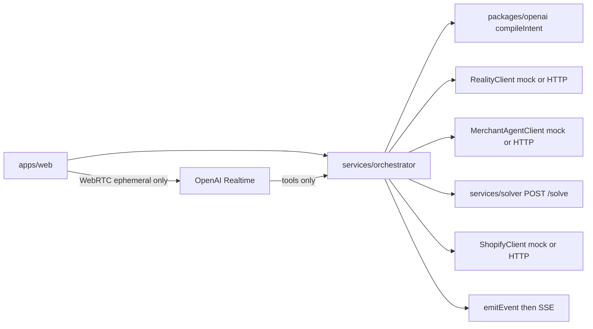
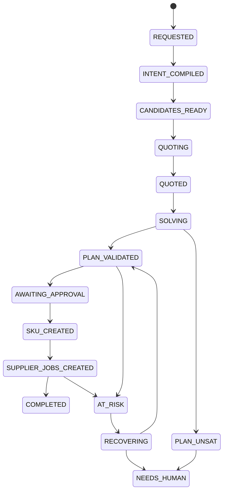

# OpenAI implementation

> **Audience:** Person 2 (OpenAI + orchestrator + solver + customer web) and any coding agent implementing that ownership.
> **Canonical sources:** [`Molecule_OS_AI_Agent_Implementation_Playbook.pdf`](../Molecule_OS_AI_Agent_Implementation_Playbook.pdf), [`AGENTS.md`](../AGENTS.md), [`ARCHITECTURE.md`](ARCHITECTURE.md), [`CONTRACTS.md`](CONTRACTS.md), [`TASKS/OPENAI.md`](TASKS/OPENAI.md).
> **Rule:** If this document conflicts with `@molecule/contracts`, contracts win. If an OpenAI API differs from assumptions below, update the adapter and document the discrepancy; do not silently change cross-service payloads.

This file is the Person 2 execution bible. Work packets are strictly ordered. Do not start a later packet until the earlier packet’s definition of done is green. **Voice (O5) is forbidden until the mock text end-to-end path (O3) passes.**

---

## 0. Machine-readable packet index

| ID  | Title                              | Depends on | Hard gate                                          |
| --- | ---------------------------------- | ---------- | -------------------------------------------------- |
| O0  | Prerequisites, keys, smoke test    | —          | Credentials or explicit mock escalation by T+2h    |
| O1  | Orchestrator state machine         | O0         | Illegal transitions rejected by unit tests         |
| O2  | OpenAI adapter + intent compiler   | O0, O1     | Invalid model JSON cannot escape adapter           |
| O3  | Mock text end-to-end               | O1, O2     | Text path green before any voice work              |
| O4  | Customer web shell                 | O3         | SSE + intent panel + graph render from mock stream |
| O5  | Realtime voice                     | O3, O4     | Two barge-ins without state loss                   |
| O6  | Candidate/quote orchestration      | O3         | One timed-out merchant does not fail order         |
| O7  | Deterministic solver               | O1         | Only solver may emit `VALID`                       |
| O8  | Execute and recover                | O6, O7     | Chaos recovery without conversation restart        |
| O9  | Reality extraction callback        | O2         | Extraction only; Person 4 owns claims              |
| O10 | Codex adversarial suite + evidence | O1–O8      | One documented before/after story                  |
| O11 | Demo surfaces Person 2 drives      | O8         | Acceptance rows Person 2 owns checked              |
| O12 | Hardening, fallbacks, freeze       | O11        | Three consecutive clean demos from reset           |

---

## 1. Ownership, invariants, and stop rules

### 1.1 Owned paths (edit freely)

- `apps/web/**`
- `packages/openai/**`
- `services/orchestrator/**`
- `services/solver/**`
- Person 2 tests under those trees
- `scripts/verify-openai.ts`, `scripts/adversary/**` (Person 2–driven portions)
- `docs/CODEX_EVIDENCE.md` (fill with real evidence)
- Root scripts wiring for `verify:openai` / solver launch if needed

### 1.2 Do not modify without explicit coordination

- `packages/shopify/**`, `apps/shopify-app/**`
- `packages/backboard/**`, `services/merchant-agents/**`
- `packages/db/**`, `packages/events/**` (base), `sql/**`, `services/reality/**`
- Redefining domain types inside `packages/openai` instead of importing `@molecule/contracts`
- Shared schema removals/renames without a standalone contracts PR first

### 1.3 Non-negotiable invariants

1. Import domain schemas from `@molecule/contracts`. Do not redefine them.
2. LLMs may interpret and propose; **only `services/solver` may set `plan.status = "VALID"`**.
3. All external provider calls go through adapters with mock equivalents.
4. All external mutations require `traceId` and deterministic `actionKey` / idempotency handling.
5. Every meaningful state change emits a `MoleculeEvent` and is persisted before or with UI broadcast.
6. Never expose `OPENAI_API_KEY` (or any provider secret) in browser code, `NEXT_PUBLIC_*` vars, fixtures, or logs.
7. Never log private model chain-of-thought. Log structured tool, validator, evidence, and decision events only.
8. Unknown or conflicted merchant facts remain unknown or conflicted. Never guess operational truth in the orchestrator.
9. Realtime tools call **orchestrator HTTP only**. They never call Shopify, Backboard, or Tiger SDKs directly.

### 1.4 Stop / escalate immediately if

- Credentials cannot be verified by T+2h → continue on `MockOpenAIAdapter` and escalate.
- A contract schema you need is missing → open/notify Person 4 shared-contract gate; do not invent parallel types in the adapter.
- Another owner’s package must change for your work → request a small PR; do not edit it yourself.
- You are tempted to let the LLM certify feasibility → stop; route through the solver.

---

## 2. Current repository reality (as of scaffold)

Empty owned trees (`.gitkeep` only):

- `apps/web/`
- `packages/openai/`
- `services/orchestrator/`
- `services/solver/`
- `scripts/`

Already present and must be consumed:

- [`packages/contracts/src/index.ts`](../packages/contracts/src/index.ts): `ProductIntent`, `QuoteResponse`, `ProductionPlan`, `MoleculeEvent`, `Constraint`, `AssetRef`, `AmbiguityFlag`, related sub-schemas

Env stubs already in [`.env.example`](../.env.example):

```bash
OPENAI_API_KEY=
OPENAI_REALTIME_MODEL=gpt-realtime
OPENAI_COMPILER_MODEL=
```

---

## 3. Architecture Person 2 owns



### 3.1 Order session state machine



**Hard guards**

- No transition to `PLAN_VALIDATED` unless solver returned `status: "VALID"`.
- No transition to `SKU_CREATED` without a currently valid plan for the current `intentVersion`.
- No execution mutation without `traceId` + `actionKey` and idempotency record handling.
- Stale async responses for an older `intentVersion` or plan generation number must be ignored.

### 3.2 Person 2 HTTP routes

| Method / route                              | Request → response                       | Hard rule                                 |
| ------------------------------------------- | ---------------------------------------- | ----------------------------------------- |
| `POST /api/intents/compile`                 | `CompileIntentRequest` → `ProductIntent` | Strict schema; never free-form intent     |
| `POST /api/plans/solve`                     | `SolverInput` → `ProductionPlan`         | **Only** route allowed to declare `VALID` |
| `POST /api/execution/commit`                | Valid plan → `ExecutionReceipt`          | Reject plans without solver `VALID`       |
| `GET /api/orders/:id/events`                | SSE `MoleculeEvent` stream               | Backed by persisted rows                  |
| `POST /api/chaos`                           | Scenario → event + mutation receipt      | Demo-only; `DEMO_MODE` + secret/localhost |
| Server route minting Realtime client secret | → ephemeral `ek_…`                       | Never returns `OPENAI_API_KEY`            |

Upstream routes Person 2 **calls** via clients (do not implement their internals):

- Reality: ingest/resolve/candidates
- Merchant agents: quote/reserve
- Shopify adapter methods through `ShopifyClient`

### 3.3 Event taxonomy Person 2 must emit

`intent.received`, `intent.compiled`, `intent.updated`, `candidate.search.completed` (when orchestrating), `merchant.quote.requested`, `merchant.quote.received`, `merchant.quote.timeout`, `solver.started`, `solver.valid`, `solver.unsat`, `shopify.product.created`, `shopify.customer_order.created`, `shopify.supplier_job.created` (via execution path), `plan.invalidated`, `recovery.started`, `recovery.completed`, `recovery.failed`, `demo.chaos.triggered`.

Every event: `traceId` required; `orderId` when order-scoped; `merchantId` when merchant-scoped; `source` includes `"openai" | "solver" | "ui"` as appropriate.

---

## 4. Shared-contract gate (Person 4 owns schemas)

Person 2 **consumes** these. If missing from `@molecule/contracts`, propose them in a contracts PR; do not redefine in `packages/openai`.

### 4.1 Already shipped (import these)

- `ProductIntentSchema` / `ProductIntent`
- `QuoteResponseSchema` / `QuoteResponse`
- `ProductionPlanSchema` / `ProductionPlan`
- `MoleculeEventSchema` / `MoleculeEvent`
- Supporting: `DesiredOutput`, `TransformationNeed`, `Constraint`, `WeightedPreference`, `AssetRef`, `AmbiguityFlag`, plan node/edge/constraint result schemas

### 4.2 Proposed shapes Person 2 needs (request from Person 4)

Use these as the negotiation surface. Names may vary slightly if Person 4 already landed equivalents—import theirs.

```ts
// CompileIntentRequest — input to POST /api/intents/compile and compileIntent()
export const CompileIntentRequestSchema = z.object({
  orderId: z.string().min(1),
  traceId: z.string().min(1),
  text: z.string().min(1),
  conversationSummary: z.string().optional(),
  assets: z.array(AssetRefSchema).default([]),
  previousIntent: ProductIntentSchema.optional(),
  correction: z
    .object({
      kind: z.enum([
        "constraint",
        "preference",
        "quantity",
        "deadline",
        "budget",
        "other",
      ]),
      text: z.string().min(1),
    })
    .optional(),
});

// QuoteRequest — orchestrator → merchant-agents
export const QuoteRequestSchema = z.object({
  orderId: z.string(),
  traceId: z.string(),
  merchantId: z.string(),
  capabilityId: z.string(),
  intentVersion: z.number().int().positive(),
  quantity: z.number().int().positive(),
  deadline: z.iso.datetime(),
  currency: CurrencySchema,
  hardConstraints: z.array(ConstraintSchema).default([]),
  softPreferences: z.array(WeightedPreferenceSchema).default([]),
  hold: z.boolean().default(false),
  actionKey: z.string().optional(),
});

// CandidateCapability — Reality search result (rank only, not compatibility certificate)
export const CandidateCapabilitySchema = z.object({
  capabilityId: z.string(),
  merchantId: z.string(),
  score: z.number(),
  capability: MerchantCapabilitySchema.optional(),
  risk: z
    .object({
      p50: z.number().optional(),
      p95: z.number().optional(),
      p99: z.number().optional(),
      sampleCount: z.number().int().nonnegative(),
      confidence: z.enum(["low", "medium", "high"]),
    })
    .optional(),
});

// SolverInput — POST /api/plans/solve and Python /solve
export const SolverInputSchema = z.object({
  orderId: z.string(),
  traceId: z.string(),
  intent: ProductIntentSchema,
  candidates: z.array(CandidateCapabilitySchema),
  quotes: z.array(QuoteResponseSchema),
  changePenaltyNodeIds: z.array(z.string()).default([]),
});

// ExecutionReceipt — commit output
export const ExecutionReceiptSchema = z.object({
  orderId: z.string(),
  planId: z.string(),
  intentVersion: z.number().int().positive(),
  compositeProduct: z
    .object({
      storeDomain: z.string(),
      productGid: z.string(),
      variantGid: z.string().optional(),
      adminUrl: z.string().optional(),
      storefrontUrl: z.string().optional(),
    })
    .optional(),
  customerOrder: z
    .object({
      draftOrderGid: z.string().optional(),
      orderGid: z.string().optional(),
      checkoutUrl: z.string().optional(),
    })
    .optional(),
  supplierJobs: z.array(
    z.object({
      merchantId: z.string(),
      nodeId: z.string(),
      draftOrderGid: z.string(),
      storeDomain: z.string(),
    }),
  ),
  actionKeys: z.array(z.string()),
});

// ChaosRequest — POST /api/chaos
export const ChaosRequestSchema = z.object({
  scenario: z.enum([
    "supplier_offline",
    "inventory_zero",
    "price_spike",
    "lead_time_delay",
    "conflicting_document",
  ]),
  orderId: z.string().optional(),
  merchantId: z.string().optional(),
  secret: z.string().optional(),
});
```

Until these land: implement orchestrator interfaces against local TypeScript types **only inside mocks**, marked `// TODO: replace with @molecule/contracts`, and block real integration merges until the contracts PR lands.

---

## 5. Target file trees

### 5.1 `packages/openai`

```text
packages/openai/
├─ package.json
├─ tsconfig.json
├─ vitest.config.ts
├─ src/
│  ├─ index.ts
│  ├─ OpenAIAdapter.ts          # interface
│  ├─ RealOpenAIAdapter.ts
│  ├─ MockOpenAIAdapter.ts
│  ├─ compileIntent.ts          # thin wrapper or method
│  ├─ schema/
│  │  └─ productIntentJsonSchema.ts  # strict JSON Schema for Responses API
│  ├─ prompts/
│  │  └─ intentCompiler.ts
│  ├─ errors.ts
│  ├─ extractClaims.ts          # O9 optional Reality callback
│  └─ realtime/
│     └─ mintClientSecret.ts    # server-only helper
└─ tests/
   ├─ compileIntent.mock.test.ts
   ├─ compileIntent.fixtures.test.ts
   └─ fixtures/
      ├─ initial-requests.json
      └─ corrections.json
```

### 5.2 `services/orchestrator`

```text
services/orchestrator/
├─ package.json
├─ tsconfig.json
├─ src/
│  ├─ index.ts                  # Fastify (preferred) or HTTP server entry
│  ├─ config.ts
│  ├─ session/
│  │  ├─ OrderSession.ts
│  │  ├─ transitions.ts
│  │  └─ staleGuard.ts
│  ├─ clients/
│  │  ├─ RealityClient.ts
│  │  ├─ MerchantAgentClient.ts
│  │  ├─ SolverClient.ts
│  │  ├─ ShopifyClient.ts
│  │  └─ OpenAIClient.ts
│  ├─ mocks/
│  │  └─ ...
│  ├─ routes/
│  │  ├─ intents.ts
│  │  ├─ plans.ts
│  │  ├─ execution.ts
│  │  ├─ events.ts
│  │  ├─ chaos.ts
│  │  └─ realtimeToken.ts
│  ├─ workflow/
│  │  ├─ compile.ts
│  │  ├─ quoteFanout.ts
│  │  ├─ solve.ts
│  │  ├─ commit.ts
│  │  └─ recover.ts
│  └─ events/
│     └─ emitEvent.ts
└─ tests/
   ├─ transitions.test.ts
   ├─ staleGuard.test.ts
   └─ mockHappyPath.test.ts
```

### 5.3 `services/solver`

```text
services/solver/
├─ requirements.txt
├─ pyproject.toml               # optional
├─ app/
│  ├─ main.py                   # FastAPI: /health, POST /solve
│  ├─ models.py                 # Pydantic mirrors
│  ├─ graph.py                  # NetworkX DAG validation
│  ├─ cpsat.py                  # OR-Tools selection
│  ├─ relaxations.py
│  └─ config.py                 # objective weights
└─ tests/
   ├─ test_valid_vs_risky.py
   ├─ test_unsat_relaxations.py
   └─ fixtures/
```

### 5.4 `apps/web`

```text
apps/web/
├─ package.json
├─ next.config.ts
├─ app/
│  ├─ layout.tsx
│  ├─ page.tsx
│  ├─ api/realtime/token/route.ts   # if minting from Next; else proxy to orchestrator
│  └─ components/
│     ├─ ConversationPanel.tsx
│     ├─ IntentContractPanel.tsx
│     ├─ ProductionGraph.tsx        # React Flow
│     ├─ EventFeed.tsx
│     ├─ VoiceControls.tsx
│     └─ placeholders/
│        ├─ MerchantTwinSlot.tsx    # Person 3
│        ├─ ProvenanceSlot.tsx      # Person 4
│        └─ ShopifyDebugSlot.tsx    # Person 1
└─ lib/
   ├─ orchestratorClient.ts
   ├─ sse.ts
   └─ realtime/
      └─ webrtcSession.ts
```

---

## Packet O0 — Prerequisites, keys, and smoke test

```text
TITLE: OpenAI credentials + verify:openai smoke
OWNER AREA: openai
OBJECTIVE: Local env can authenticate to OpenAI Responses and mint a Realtime client secret, or escalate to mock-only with a logged decision.
READ FIRST:
- AGENTS.md
- docs/OPENAI_IMPLEMENTATION.md (this file) §O0
- .env.example
ALLOWED FILES:
- .env (local only, never commit)
- scripts/verify-openai.ts
- package.json (script wiring only)
DO NOT MODIFY:
- other owner packages
- committed secrets
```

### O0.1 Account and key setup (human steps)

1. Sign in to [https://platform.openai.com](https://platform.openai.com).
2. Create or select a project for Molecule OS.
3. Enable billing / attach a payment method so Realtime and Responses calls succeed.
4. Create an API key with access to:
   - Responses API (structured outputs)
   - Realtime API (`gpt-realtime` or the pinned realtime model)
5. Confirm organization policies allow browser Realtime via ephemeral client secrets.
6. Copy [`.env.example`](../.env.example) → `.env` in the repo root.
7. Set:

```bash
OPENAI_API_KEY=sk-...          # server only
OPENAI_REALTIME_MODEL=gpt-realtime
OPENAI_COMPILER_MODEL=         # fill after first successful structured-output smoke
```

**Forbidden**

- `NEXT_PUBLIC_OPENAI_API_KEY` or any browser-exposed OpenAI secret
- Committing `.env`
- Logging the raw key in smoke scripts

### O0.2 Choose and freeze the compiler model

1. Prefer a current model that supports Responses **structured outputs** (`text.format.type = "json_schema"`, `strict: true`). Starting candidates (verify against live docs on implementation day): `gpt-5.6`, `gpt-6-astra`, or the newest documented structured-output model your org has access to.
2. Run one structured-output smoke that returns a tiny fixed schema (e.g. `{ "ok": true }`).
3. Write the **exact working model id** into `OPENAI_COMPILER_MODEL`.
4. At demo freeze (O12), do not change the pinned model without a regression run.

### O0.3 Implement `scripts/verify-openai.ts`

Behavior:

1. Load env (`OPENAI_API_KEY`, models).
2. Call Responses API once with a trivial strict schema; assert parse success.
3. Call `POST https://api.openai.com/v1/realtime/client_secrets` with:

```json
{
  "expires_after": { "anchor": "created_at", "seconds": 60 },
  "session": {
    "type": "realtime",
    "model": "<OPENAI_REALTIME_MODEL>"
  }
}
```

4. Assert response contains an ephemeral value starting with `ek_` (or documented prefix) and an expiry.
5. Print **only** sanitized lines, e.g.:

```text
openai.verify responses ok model=<id> latency_ms=<n>
openai.verify realtime_client_secret ok expires_in_s=<n>
```

6. Exit non-zero on auth/network/schema failure. Never print the API key or full secret body.

Wire: `"verify:openai": "tsx scripts/verify-openai.ts"` (or equivalent) in root `package.json`.

### O0.4 Definition of done (O0)

- [ ] `.env` exists locally with key + realtime model set
- [ ] `pnpm verify:openai` prints sanitized success **or** team has an explicit written decision to proceed mock-only until credentials arrive
- [ ] `OPENAI_COMPILER_MODEL` filled after first successful structured call (or documented blocker)

**Fallback:** If verify fails by T+2h, implement O1–O4 against `MockOpenAIAdapter` and escalate credentials. Do not block the mock text path on real OpenAI.

---

## Packet O1 — Orchestrator state machine first

```text
TITLE: OrderSession state machine + provider client interfaces
OWNER AREA: openai
OBJECTIVE: Mock happy path can run end-to-end before any provider SDK is integrated; illegal transitions throw.
READ FIRST:
- AGENTS.md
- docs/ARCHITECTURE.md
- docs/CONTRACTS.md
- docs/OPENAI_IMPLEMENTATION.md §3, §O1
ALLOWED FILES:
- services/orchestrator/**
- services/orchestrator tests
DO NOT MODIFY:
- packages/shopify, packages/backboard, packages/db, sql
INPUT CONTRACTS:
- ProductIntent, ProductionPlan, MoleculeEvent (and proposed CompileIntentRequest when available)
OUTPUT CONTRACTS:
- OrderSession aggregate + typed events
```

### O1.1 Implementation requirements

1. Scaffold `services/orchestrator` as a Node/TypeScript service (Fastify preferred; Next route handlers acceptable if time-constrained).
2. Implement `OrderSession` aggregate fields at minimum:
   - `orderId`, `traceId`
   - `state` enum covering the diagram in §3.1
   - `intent: ProductIntent | null`
   - `candidates`, `quotes`, `activePlan`
   - `externalRefs` (Shopify GIDs, etc.)
   - `intentVersion`, `planGeneration` (monotonic for stale guards)
3. Implement `transition(session, event)` with explicit guards.
4. Implement `emitEvent(event)`:
   - Validate with `MoleculeEventSchema`
   - Persist via event adapter interface (mock in-memory first; Tiger later)
   - Publish to SSE subscribers for that `orderId`
5. Define client interfaces (no SDK imports yet):
   - `OpenAIClient.compileIntent`
   - `RealityClient.resolve / searchCandidates`
   - `MerchantAgentClient.quote / reserve`
   - `SolverClient.solve`
   - `ShopifyClient.createCompositeProduct / createCustomerPath / createSupplierJobs / …`
6. Env flags to swap mock vs real clients later (`USE_MOCK_OPENAI=true`, etc.).

### O1.2 Error / fallback

- Illegal transition → typed error, session unchanged, emit `severity` event optional
- Persistence failure → do not pretend UI broadcast succeeded

### O1.3 Tests required

- Unit: every illegal transition listed in guards fails
- Unit: valid path `REQUESTED → … → PLAN_VALIDATED` with mock solver `VALID`
- Unit: cannot enter `SKU_CREATED` without valid plan

### O1.4 Definition of done (O1)

- [ ] `pnpm --filter <orchestrator> test` covers invalid transitions
- [ ] Mock happy path function exists and is callable without OpenAI/Shopify/Backboard credentials
- [ ] No provider SDK imported in orchestrator yet (interfaces only)

---

## Packet O2 — OpenAI strict multimodal intent compiler

```text
TITLE: packages/openai compileIntent with Responses structured output
OWNER AREA: openai
OBJECTIVE: Invalid model output cannot escape the adapter; 10 initial + 5 correction fixtures pass (then expand to 20+).
ALLOWED FILES:
- packages/openai/**
DO NOT MODIFY:
- @molecule/contracts domain definitions (import only)
- apps/web voice UI (not yet)
INPUT CONTRACTS:
- CompileIntentRequest (or interim local type marked TODO)
OUTPUT CONTRACTS:
- ProductIntent (Zod-validated)
```

### O2.1 Adapter interface

```ts
export interface OpenAIAdapter {
  compileIntent(input: CompileIntentRequest): Promise<ProductIntent>;
  // O9 optional:
  extractClaims?(input: unknown): Promise<unknown>;
}
```

Implement `RealOpenAIAdapter` and `MockOpenAIAdapter` with identical contract behavior at the boundary.

### O2.2 Responses API call shape (GA)

Use the official OpenAI Node SDK server-side only.

Critical settings:

- `model: process.env.OPENAI_COMPILER_MODEL`
- Multimodal `input`: conversation summary, customer text, image/file refs (`assets`), previous `ProductIntent` when patching
- Structured outputs via Responses:

```ts
text: {
  format: {
    type: "json_schema",
    name: "product_intent",
    strict: true,
    schema: productIntentJsonSchema, // every property required; additionalProperties: false
  },
}
```

Notes for agents:

- Zod `ProductIntentSchema` may need a **strict JSON Schema projection** for OpenAI (all fields required, `additionalProperties: false`). Keep the projection in `packages/openai/src/schema/`; still **re-validate** the parsed object with Zod before return.
- Prefer SDK helpers that build strict schemas from Zod if available; otherwise hand-maintain the projection and keep it in sync with contracts via tests.
- Explicit timeout (e.g. 20–30s). Typed errors: `OpenAITimeoutError`, `OpenAIValidationError`, `OpenAIAuthError`, `OpenAIRateLimitError`.

### O2.3 Validation and retry policy

1. Parse model JSON.
2. `ProductIntentSchema.safeParse(...)`.
3. On failure: **retry once** with schema error feedback in the next input (list Zod issues).
4. On second failure: throw / return visible failure to orchestrator; **never** return partially valid intent.
5. Log only: model id, latency, validation success/fail, issue codes—not chain-of-thought.

### O2.4 Prompt rules (must encode in system/developer instructions)

1. Distinguish **hardConstraints** vs **softPreferences**.
2. Do **not** fabricate budget, deadline, materials, quantity, or currency. If missing and blocking, set `ambiguityFlags` with a concrete `question`.
3. Preserve user corrections over older statements.
4. When `previousIntent` + `correction` present: produce a new intent with `version = previous.version + 1`, merging patches; do not drop unaffected fields.
5. Assets: attach only provided refs; do not invent URLs.
6. Default currency from demo config when user specifies none **only if** product policy allows; otherwise flag ambiguity. Prefer `DEMO_DEFAULT_CURRENCY=CAD` when the request is clearly a demo onboarding kit and currency is omitted—document this demo convention in the prompt.

### O2.5 Mock adapter

Deterministic mapping from fixture ids / keyword hashes to canned valid `ProductIntent` objects. Used by O3 and CI without credentials.

### O2.6 Fixtures (minimum then expand)

**Phase A (first agent prompt):** ≥10 initial requests + ≥5 correction patches.

**Phase B (before demo freeze):** ≥20 paraphrased requests including:

- Image/logo asset present
- File/SVG asset present
- Blocking ambiguity cases that intentionally leave flags
- “No polyester” / material exclusions
- Budget + deadline combinations
- Quantity changes mid-order

Acceptance: **20/20** either parse to valid `ProductIntent` or intentionally surface blocking ambiguity (not silent garbage).

### O2.7 Correction / version semantics

- Correction increments `intent.version`.
- Orchestrator invalidates only **affected** plan state (`plan.invalidated`), bumps `planGeneration` as needed, and re-runs quote/solve for the new version.
- Tests must prove older async results for `intentVersion - 1` cannot overwrite current session state (see O8 stale guard).

### O2.8 Tests required

- Mock adapter fixture suite
- Real adapter unit tests with mocked HTTP if no key; one credentialed smoke when available
- Schema projection ↔ Zod round-trip tests for at least one full intent
- Malformed model output → retry → fail path

### O2.9 Definition of done (O2)

- [ ] Invalid JSON / schema-invalid objects cannot leave `compileIntent`
- [ ] ≥10 initial + ≥5 correction fixtures green
- [ ] Timeouts and typed errors exist
- [ ] Mock and real adapters share the interface
- [ ] No API key in tests/logs

---

## Packet O3 — Mock text end-to-end (hard gate before voice)

```text
TITLE: Mock text path intent → candidates → quotes → solve → fake execution → events
OWNER AREA: openai
OBJECTIVE: Prove contracts and UI wiring before Realtime complexity.
ALLOWED FILES:
- services/orchestrator/**
- packages/openai/**
- apps/web/** (minimal text UI OK)
- packages/test-fixtures contributions if coordinated
DO NOT MODIFY:
- Realtime voice clients yet
```

### O3.1 Flow

1. Web or test client posts raw text to orchestrator.
2. Emit `intent.received`.
3. `compileIntent` (mock or real) → `ProductIntent` → `intent.compiled`.
4. `RealityClient` mock returns candidates → `candidate.search.completed`.
5. Fan-out mock quotes (can be inline stubs before O6 polish).
6. `SolverClient` mock or real solver returns `VALID` plan → `solver.valid`.
7. Fake execution receipts → Shopify-shaped mock refs.
8. SSE stream delivers events; UI graph updates.

### O3.2 Routes that must exist

- `POST /api/intents/compile`
- `POST /api/plans/solve` (proxy to solver or mock)
- `POST /api/execution/commit` (mock Shopify client)
- `GET /api/orders/:id/events` (SSE)

Text fallback UX must call the **same** orchestrator endpoints the voice tools will later call.

### O3.3 Definition of done (O3)

- [ ] Integration/mock test: text request produces VALID plan events without real Shopify/Backboard
- [ ] UI or CLI consumer can follow the SSE stream
- [ ] **Only after this is green may O5 start**

---

## Packet O4 — Customer web shell

```text
TITLE: Next.js customer UI shell for conversation, intent, graph, events
OWNER AREA: openai
ALLOWED FILES:
- apps/web/**
DO NOT MODIFY:
- Person 3/4/1 internals; use placeholder slots only
```

### O4.1 Required UI surfaces

1. **Conversation panel** — text input first; voice controls stubbed until O5.
2. **Intent / contract panel** — renders current `ProductIntent` (constraints, preferences, ambiguity flags, version).
3. **Production graph** — React Flow nodes/edges from `ProductionPlan`.
4. **Event feed** — known `eventType`s rendered; unknown types shown gracefully.
5. **Listening / speaking indicators** — wired in O5; reserve UI states now.
6. **Text / voice toggle** — same tool/orchestrator backend.

Placeholders only:

- Merchant Twin / agent activity (Person 3)
- Provenance drawer (Person 4)
- Shopify Admin debug links (Person 1)

### O4.2 SSE reconnect

- On mount / reconnect, reattach to `GET /api/orders/:id/events` (or snapshot + live).
- Persisted Tiger/events rows are source of truth; do not invent client-only history that diverges.

### O4.3 Definition of done (O4)

- [ ] Next app boots against orchestrator URL from env (`NEXT_PUBLIC_ORCHESTRATOR_URL`)
- [ ] Mock order session visible: intent panel + graph + events
- [ ] No OpenAI secrets in client bundles (`pnpm` / build grep or similar check)

---

## Packet O5 — Realtime voice interface (after O3)

```text
TITLE: Realtime WebRTC voice with orchestrator-only tools
OWNER AREA: openai
OBJECTIVE: Two interruptions in one order without losing state; text fallback remains.
ALLOWED FILES:
- apps/web/** (Realtime client)
- services/orchestrator/** (token mint + tool HTTP)
- packages/openai/src/realtime/**
```

### O5.1 Key-safe session mint (GA, Sept 2026)

**Server** (orchestrator or Next server route using server env only):

`POST https://api.openai.com/v1/realtime/client_secrets`

Headers:

- `Authorization: Bearer $OPENAI_API_KEY`
- `Content-Type: application/json`
- Prefer `OpenAI-Safety-Identifier` bound to hashed user/session id

Body example:

```json
{
  "expires_after": { "anchor": "created_at", "seconds": 600 },
  "session": {
    "type": "realtime",
    "model": "gpt-realtime",
    "instructions": "<short Molecule voice agent instructions>",
    "audio": { "output": { "voice": "marin" } }
  }
}
```

Return to browser **only** `{ value: data.value }` (ephemeral `ek_…`). Never the master key.

**Browser:**

1. Fetch ephemeral token from your server.
2. Create WebRTC `RTCPeerConnection`, capture mic, attach remote audio.
3. Create SDP offer; `POST https://api.openai.com/v1/realtime/calls` with:
   - `Authorization: Bearer <ephemeral_key>`
   - `Content-Type: application/sdp`
   - body = offer SDP
4. Set remote description from answer SDP.

Do **not** use obsolete beta paths (`/v1/realtime/sessions` mint tutorials, `OpenAI-Beta: realtime=v1`) unless docs on implementation day still require them—prefer GA `client_secrets` + `calls`.

### O5.2 Realtime tools (function calling)

Each tool calls orchestrator HTTP; never Shopify/Backboard/Tiger SDKs:

| Tool                   | Purpose                                             |
| ---------------------- | --------------------------------------------------- |
| `compile_intent`       | Compile or recompile from latest utterance + assets |
| `update_constraint`    | Apply hard/soft constraint correction               |
| `get_order_status`     | Summarize session state for speech                  |
| `explain_current_plan` | Narrate plan nodes without raw logs                 |
| `approve_and_execute`  | User approval → commit path                         |
| `trigger_demo_failure` | Chaos `supplier_offline` when `DEMO_MODE`           |

Tool handlers on the server validate args, attach `traceId` / `orderId` from session context, and return short structured results the model can speak.

### O5.3 Interruption behavior

1. When user speech detected while assistant audio plays: cancel/stop current output per Realtime client flow.
2. Capture correction; call `update_constraint` / `compile_intent`.
3. UI immediately shows listening vs speaking.
4. Acceptance: interrupt **twice** in one order without losing `OrderSession`.

### O5.4 Structured system events for narration

Feed short facts into the Realtime session (not raw logs), e.g.:

- `StitchWorks declined; checking two alternatives`
- `Plan invalidated; recovering`

### O5.5 Fallback

If Realtime is unstable: switch UI to text; keep Responses compiler real. Do not rewrite architecture onto a different voice stack in final hours.

### O5.6 Definition of done (O5)

- [ ] Master API key never appears in browser network tab except ephemeral `ek_`
- [ ] Two barge-ins preserve state
- [ ] Changing “no polyester” updates intent, removes invalid candidates, and voice/text confirms
- [ ] Text toggle uses same orchestrator tools

---

## Packet O6 — Candidate / quote orchestration

```text
TITLE: Reality candidates + Backboard quote fan-out with timeouts
OWNER AREA: openai
ALLOWED FILES:
- services/orchestrator/src/workflow/quoteFanout.ts
- related clients/mocks/tests
```

### O6.1 Requirements

1. From `ProductIntent`, call `RealityClient` for canonical state + `searchCandidates` top N per capability need.
2. Fan out `QuoteRequest` with `Promise.allSettled` and **per-agent timeouts**.
3. Timeout ⇒ treat merchant as unavailable; emit `merchant.quote.timeout`; **do not fail the order**.
4. Normalize `QuoteResponse` via schema.
5. Exclude `DECLINE` from feasible set; keep `COUNTEROFFER` as alternate constraint patches for solver/UI.
6. Emit `merchant.quote.requested` / `received` / `timeout`.

### O6.2 Definition of done (O6)

- [ ] One unavailable merchant does not fail the order
- [ ] Demo path can show ≥3 quotes in event stream/UI
- [ ] Declined quotes never enter solver feasible set

---

## Packet O7 — Deterministic solver service

```text
TITLE: Python FastAPI solver with NetworkX + OR-Tools CP-SAT
OWNER AREA: openai
ALLOWED FILES:
- services/solver/**
```

### O7.1 Endpoints

- `GET /health`
- `POST /solve` — body `SolverInput` → `ProductionPlan`

### O7.2 Implementation requirements

1. Pydantic models mirroring exported JSON from `@molecule/contracts` (generate from shared JSON examples if Person 4 provides them; otherwise hand-mirror and add drift tests).
2. NetworkX: validate candidate graphs are acyclic and type-compatible along ports/materials.
3. OR-Tools CP-SAT: discrete merchant/capability selection under budget, quantity, deadline, capacity.
4. Objective weights in `config.py` (explainable in demo):
   - final cost
   - p95 risk
   - merchant-hop penalty
   - soft-preference deviation
   - fragility
5. Always return complete `constraintResults`.
6. If UNSAT: compute actionable `unsatRelaxations` by softening one hard constraint at a time (budget +Δ, deadline +hours, quantity reduction). Unresolved customer details are an exception: return their clarification questions/reasons with no relaxations. Changing budget, deadline or quantity cannot supply missing artwork, names or destinations.
7. **Never** invent `VALID` from heuristics outside CP-SAT/feasibility checks.

### O7.3 Tests required

- Cheapest merchant loses when p95/deadline risk makes it invalid; safer merchant wins
- Impossible deadline → `UNSAT` with ≥1 relaxation
- Cyclic DAG rejected
- VALID plan never contains unsatisfied constraints (align with Zod `ProductionPlanSchema` superRefine)

### O7.4 Local run

```bash
cd services/solver
python -m venv .venv
source .venv/bin/activate
pip install -r requirements.txt
uvicorn app.main:app --reload --port 8000
```

Env: `SOLVER_URL=http://localhost:8000`.

### O7.5 Definition of done (O7)

- [ ] Solver is the only producer of `status: "VALID"`
- [ ] Unit tests for risky-cheap vs safe and UNSAT relaxations pass
- [ ] Orchestrator `SolverClient` talks to this service behind the interface

---

## Packet O8 — Execute and recover

```text
TITLE: Commit valid plans + chaos recovery with stale guards
OWNER AREA: openai
ALLOWED FILES:
- services/orchestrator/src/workflow/commit.ts
- services/orchestrator/src/workflow/recover.ts
- services/orchestrator/src/routes/chaos.ts
- tests
```

### O8.1 Commit path

When plan is `VALID` and user approves:

1. Verify `activePlan.status === "VALID"` and `intentVersion` matches.
2. `actionKey`s e.g. `composite-product:{orderId}:{intentVersion}`, supplier job keys per node.
3. Call `ShopifyClient` for composite product, customer path, supplier jobs.
4. Persist external refs; emit Shopify-related events via orchestrator.
5. Transition `AWAITING_APPROVAL → SKU_CREATED → SUPPLIER_JOBS_CREATED → COMPLETED` as steps succeed.

Reject commit if plan is not solver-validated.

### O8.2 Recovery path

On plan-affecting event (chaos, webhook-normalized event, etc.):

1. Emit `plan.invalidated`, move to `AT_RISK` / `RECOVERING`.
2. Determine affected nodes; re-quote as needed; call `/solve` with `changePenaltyNodeIds` for unaffected nodes.
3. If new `VALID` plan: execute only necessary supplier-job deltas; emit `recovery.completed`; narrate cost/deadline delta.
4. If fail: `NEEDS_HUMAN` + present smallest `unsatRelaxations`; emit `recovery.failed`.

### O8.3 Stale response guard

Before applying any async quote/solve/commit result:

```text
if result.intentVersion !== session.intentVersion → ignore
if result.planGeneration < session.planGeneration → ignore
```

### O8.4 Chaos gate

`POST /api/chaos` requires `DEMO_MODE=true` and server-side `DEMO_SECRET` (or localhost restriction). Hero scenario: `supplier_offline`.

### O8.5 Definition of done (O8)

- [ ] Supplier-offline chaos → replacement plan + updated supplier job without restarting conversation
- [ ] Late older-version response cannot overwrite state (unit test)
- [ ] Idempotent retry of commit does not duplicate side effects (via action keys / mock Shopify)

---

## Packet O9 — Reality extraction callback (OpenAI piece for Person 4)

```text
TITLE: Optional structured extraction helper for Reality ingestion
OWNER AREA: openai
ALLOWED FILES:
- packages/openai/src/extractClaims.ts
- tests
DO NOT MODIFY:
- services/reality claim resolution logic
```

### O9.1 Rules

1. Person 2 owns the model call (Responses + strict schema for extracted fields).
2. Person 4 owns normalization, provenance, conflict resolution, quarantine.
3. Extraction returns candidate values + confidence; **never** writes `CanonicalClaim` rows directly.
4. Reality may call this via internal HTTP/callback or shared package function.

### O9.2 Definition of done (O9)

- [ ] Helper is optional/feature-flagged
- [ ] Documented input/output boundary for Person 4
- [ ] No claim table writes from `packages/openai`

---

## Packet O10 — Codex adversarial suite and evidence

```text
TITLE: Adversarial tests + CODEX_EVIDENCE story
OWNER AREA: openai
ALLOWED FILES:
- scripts/adversary/**
- relevant Person 2 tests
- docs/CODEX_EVIDENCE.md
```

### O10.1 Coverage Person 2 drives

- Stale quotes applied out of order
- Timeout storms during quote fan-out
- State-transition races
- Cyclic DAGs into solver
- Price/unit mismatches rejected at boundary
- Duplicate execution actionKeys

Coordinate with Person 4 on concurrent reservations (good Codex evidence candidate).

### O10.2 Evidence template

Fill [`docs/CODEX_EVIDENCE.md`](CODEX_EVIDENCE.md) with one **real** story:

- Initial behavior or failing test
- Evidence and diagnosis
- Change made
- Regression/adversarial test
- Commands and sanitized output
- Commit or PR
- Remaining limitations

Never include secrets or private chain-of-thought.

### O10.3 Definition of done (O10)

- [ ] One documented command runs the adversarial suite Person 2 owns
- [ ] Evidence doc has a genuine before/after story

---

## Packet O11 — Demo surfaces Person 2 drives

### O11.1 Five-minute runbook (Person 2 narration beats)

Aligned with [`DEMO_RUNBOOK.md`](DEMO_RUNBOOK.md) and playbook §24:

| Time      | Action                                                                                     |
| --------- | ------------------------------------------------------------------------------------------ |
| 0:00–0:20 | Thesis line; start request                                                                 |
| 0:20–1:00 | Speak/type request + logo; interrupt once with hard constraint; show intent version change |
| 1:00–1:40 | Hand off briefly to messy-data/provenance (Person 4)                                       |
| 1:40–2:30 | Quotes appear; p95/tail-risk selection visible in graph/events                             |
| 2:30–3:15 | Solver VALID; Shopify commit path                                                          |
| 3:15–4:20 | Judge triggers supplier offline; recovery loop                                             |
| 4:20–4:45 | Voice/text explains recovery delta                                                         |
| 4:45–5:00 | Codex evidence sentence for OpenAI judge if present                                        |

### O11.2 Acceptance matrix rows Person 2 owns

| Scenario                | Expected                                                     | Pass |
| ----------------------- | ------------------------------------------------------------ | ---- |
| Text request happy path | Intent → quotes → VALID → execution events                   | □    |
| Voice interrupt         | Mid-response hard constraint; old plan invalidated; new plan | □    |
| Tail-risk selection     | Higher-price merchant chosen because p95 meets deadline      | □    |
| UNSAT                   | Explicit relaxations; no fake VALID                          | □    |
| Supplier failure        | Chaos → AT_RISK → re-quote/solve → replacement job           | □    |
| Idempotency             | Retry commit does not duplicate                              | □    |

### O11.3 Definition of done (O11)

- [ ] Checklist above exercised at least once on mock or real stack
- [ ] Event feed shows the taxonomy §3.3 for a full run

---

## Packet O12 — Hardening, fallbacks, freeze

### O12.1 Fallback table (Person 2)

| Failure              | Fallback that preserves demo                                          | Do not do                                         |
| -------------------- | --------------------------------------------------------------------- | ------------------------------------------------- |
| Realtime unstable    | Text input; same tools; keep Responses compiler                       | Swap voice stacks late                            |
| Compiler model flaky | Pin last known good `OPENAI_COMPILER_MODEL`; mock only if auth dead   | Accept invalid JSON                               |
| Solver too ambitious | Constrain ontology to supply→transform→assemble; CP-SAT for selection | LLM certifies VALID                               |
| Time shortage        | Cut image gen / polish                                                | Cut deterministic validation or self-healing loop |

### O12.2 Freeze checklist (Person 2 items)

- [ ] Freeze `OPENAI_COMPILER_MODEL` and `OPENAI_REALTIME_MODEL`
- [ ] `pnpm verify:openai` green
- [ ] Mic permissions + text fallback verified
- [ ] Three consecutive clean demos from `demo:reset` (team command)
- [ ] Chaos gated by `DEMO_MODE` + secret
- [ ] No secrets in logs/UI
- [ ] Codex evidence captured

### O12.3 Definition of done (O12)

- [ ] Person 2 freeze items checked
- [ ] Cut-line decisions documented if any P2 features dropped

---

## 6. 36-hour critical path mapping (Person 2)

| Time     | Person 2 focus                                            | Exit condition                                                  |
| -------- | --------------------------------------------------------- | --------------------------------------------------------------- |
| T+0–1h   | O0 keys + smoke; start O1; start `CODEX_EVIDENCE.md` stub | verify or mock escalation                                       |
| T+1–4h   | O1 + O2 mock + O3 mock E2E                                | Typed text → fake execution → UI/events                         |
| T+4–9h   | Real `compileIntent`; solver v1; client interfaces        | OpenAI compile + solve work separately                          |
| T+9–14h  | O6 fan-out + O8 commit against real/mock Shopify client   | Text happy path creates plan (+ real Shopify if Person 1 ready) |
| T+14–19h | O5 Realtime                                               | Voice works; interruptions OK                                   |
| T+19–24h | O8 chaos recovery polish                                  | Supplier failure self-heals                                     |
| T+24–29h | O10 adversarial + evidence; solver risk weights           | Codex story ready                                               |
| T+29–33h | O12 hardening                                             | Fallbacks, no duplicate side effects                            |
| T+33–36h | Freeze + demos                                            | Three clean runs                                                |

---

## 7. Ready-to-paste first agent prompt

Copy this into Codex / Cursor as the **first** implementation task (after O0 human key setup):

```text
TITLE: Orchestrator skeleton + OpenAI intent compiler (mock text path first)
OWNER AREA: openai
OBJECTIVE: Contract-first OrderSession transitions and strict ProductIntent compilation; mock text end-to-end before any voice.
READ FIRST:
- AGENTS.md
- docs/ARCHITECTURE.md
- docs/CONTRACTS.md
- docs/TASKS/OPENAI.md
- docs/OPENAI_IMPLEMENTATION.md
ALLOWED FILES:
- apps/web/**
- services/orchestrator/**
- services/solver/**
- packages/openai/**
- scripts/verify-openai.ts
- and their tests
DO NOT MODIFY:
- packages/shopify/**
- packages/backboard/**
- packages/db/**
- sql/**
- services/reality/** (except calling via interface)
- services/merchant-agents/** (except calling via interface)
INPUT CONTRACTS:
- ProductIntent, MoleculeEvent from @molecule/contracts
- CompileIntentRequest when available from contracts; otherwise interim TODO type
OUTPUT CONTRACTS:
- ProductIntent (Zod-validated only)
- ProductionPlan only from solver
IMPLEMENTATION REQUIREMENTS:
1. Implement OrderSession state machine with transition guards.
2. Implement OpenAIAdapter + MockOpenAIAdapter + RealOpenAIAdapter.
3. compileIntent via Responses API structured outputs; Zod validate; retry once; then fail.
4. Add ≥10 initial and ≥5 correction fixtures.
5. Mock text path: compile → fake candidates → fake quotes → solver → fake execution → SSE.
6. Do not implement Realtime voice until mock text path tests pass.
ERROR/FALLBACK BEHAVIOR:
- Invalid model output never escapes adapter.
- Missing OpenAI credentials → mock adapter; escalate.
- Timeouts → typed errors.
TESTS REQUIRED:
- Illegal state transitions
- Fixture compile suite
- Mock happy path integration
DEFINITION OF DONE:
- Affected package tests pass
- pnpm typecheck for touched workspaces
- No secrets logged
- Voice code not started yet
```

---

## 8. Commands cheat sheet

```bash
# bootstrap
corepack enable
pnpm install
cp .env.example .env   # then fill OPENAI_*

# Person 2 verifies
pnpm verify:openai

# typical quality gates (adjust filter names once packages exist)
pnpm --filter @molecule/openai test
pnpm --filter @molecule/openai typecheck
pnpm --filter orchestrator test
cd services/solver && source .venv/bin/activate && pytest

# solver
cd services/solver && uvicorn app.main:app --reload --port 8000

# app / orchestrator (once wired)
pnpm dev
```

---

## 9. Official references (re-check on implementation day)

API details in the playbook were checked against docs available **September 17, 2026**. Re-verify before coding:

- [OpenAI Realtime API](https://platform.openai.com/docs/api-reference/realtime) — WebRTC / tools
- [Realtime WebRTC guide](https://developers.openai.com/api/docs/guides/realtime-webrtc) — `client_secrets` + `calls`
- [Responses API / Quickstart](https://platform.openai.com/docs/quickstart/make-your-first-api-request)
- [Structured Outputs](https://developers.openai.com/api/docs/guides/structured-outputs) — `text.format` json_schema strict
- [How OpenAI uses Codex](https://openai.com/business/guides-and-resources/how-openai-uses-codex/) — evidence culture

If GA endpoints differ from this document on the day you implement, update the adapter and add a short “provider deviation” note under `packages/openai/README.md` (create when implementing).

---

## 10. Explicit forbids (final checklist for agents)

- [ ] Do not edit other owners’ provider packages
- [ ] Do not expose `OPENAI_API_KEY` to the browser
- [ ] Do not let the LLM set `plan.status = "VALID"`
- [ ] Do not implement voice before O3 is green
- [ ] Do not call Shopify/Backboard/Tiger SDKs from UI or Realtime tools
- [ ] Do not log chain-of-thought
- [ ] Do not guess conflicted/unknown merchant facts
- [ ] Do not redefine `@molecule/contracts` schemas in `packages/openai`

---

_End of OpenAI implementation. Execute packets O0 → O12 in order._
